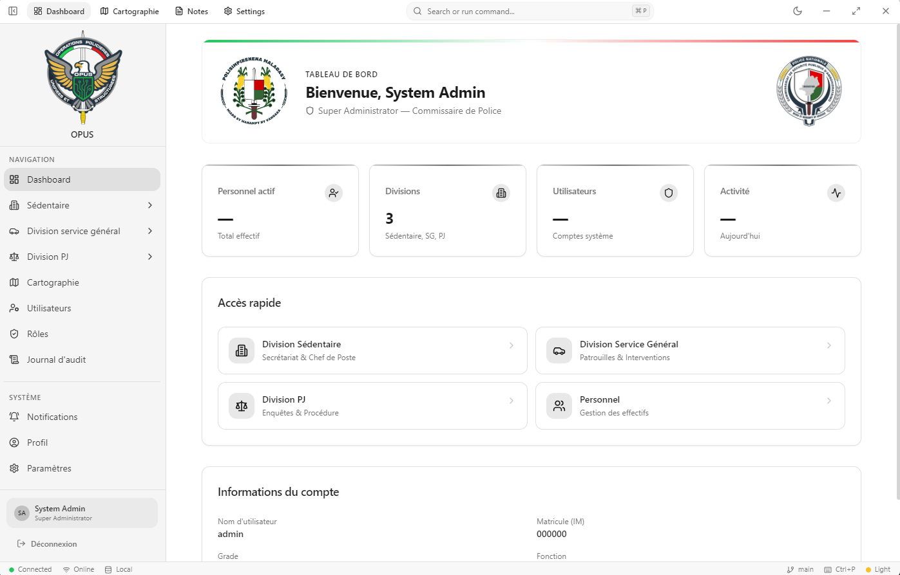

# OPUS — Opérations Policières Unifiées et Structurées

A cross-platform **Police Station Management System** with a desktop application, mobile Android app, and a REST API backend.

## Screenshots



| Platform | Technology |
|----------|-----------|
| **Desktop** | Electron + React 18 + Vite 6 + TypeScript |
| **Mobile** | Android (Kotlin/Java) |
| **API** | PHP 8+ (pure, no framework) |
| **Database** | MySQL 8.0+ |

## Project Structure

```
opus/
├── api/               # PHP REST API backend
│   ├── config/        # App & database configuration
│   ├── public/        # Front controller (index.php)
│   ├── src/           # Controllers, Models, Middleware, Helpers
│   └── uploads/       # File uploads
├── android/           # Android mobile application
│   └── app/           # Android app module
├── database/          # SQL migration scripts
├── desktop/           # Electron desktop application
│   ├── electron/      # Main process & preload
│   ├── src/           # React renderer (pages, components, stores)
│   └── dist/          # Built renderer output
├── FEATURES.md        # Requirements & feature specification
└── SPECIFICATIONS.md  # Functional specifications (French)
```

## Prerequisites

- Node.js 18+
- npm 9+
- PHP 8.0+
- MySQL 8.0+
- Android Studio (for mobile development)

## Installation

```bash
git clone https://github.com/raherygino/opus.git
cd opus

# Install desktop dependencies
cd desktop && npm install
cd ..
```

### Database Setup

```bash
# Create database and run migrations
mysql -u root -p < database/001_create_roles.sql
mysql -u root -p < database/002_create_personnel.sql
mysql -u root -p < database/003_create_users.sql
mysql -u root -p < database/004_seed_data.sql
# ... run remaining migrations in order ...
mysql -u root -p < database/013_create_device_tokens.sql   # FCM push notifications
```

### Firebase Cloud Messaging (Push Notifications)

The Android app uses **Firebase Cloud Messaging (FCM)** to receive push
notifications. When a notification is created via the API, the backend sends an
FCM push to all relevant Android devices. Setup requires both a Firebase project
and a service account key.

#### 1. Create a Firebase project

1. Go to the [Firebase Console](https://console.firebase.google.com/) and create
   a new project (e.g. `opus`).
2. Add an **Android app** with package name `com.gsoft.opus`.
3. Download `google-services.json` and place it at
   `android/app/google-services.json` (gitignored — never commit it).
   - A template is provided at `android/app/google-services.json.example`.

#### 2. Generate a service account key (for the PHP backend)

1. In Firebase Console: **Project Settings → Service Accounts → Generate New Private Key**.
2. Save the JSON file at `api/config/firebase-service-account.json`
   (gitignored — contains private keys).
3. The backend reads this file automatically (`api/config/app.php` → `fcm`).

To disable FCM (e.g. for local dev without Firebase), set the env var:

```bash
FCM_ENABLED=false
```

#### 3. Run the device tokens migration

```bash
mysql -u root -p < database/013_create_device_tokens.sql
```

#### 4. Build & run

The Android app registers its FCM token with the backend on startup (and after
login). When the API creates a notification (`POST /api/notifications`), it
automatically pushes it to the relevant devices via FCM HTTP v1 API.

#### FCM endpoints

| Method | Endpoint | Auth | Description |
|--------|----------|------|-------------|
| POST | `/api/devices/register` | Yes | Register an FCM device token |
| POST | `/api/devices/unregister` | Yes | Deactivate a single device token |
| DELETE | `/api/devices` | Yes | Deactivate all tokens for the current user (logout) |

## Development

### API Server

```bash
# Start the PHP development server
php -S 192.168.1.190:8080 -t api/public
```

The API runs at `http://localhost:8080/api` and provides endpoints for auth, personnel, and user management.

### Desktop App

```bash
cd desktop
npm run dev
# or
npm run electron:dev
```

Runs the Vite dev server with Electron hot reload.

### Android App

Open the `android/` folder in Android Studio and run on device or emulator.

## Build

### Desktop

```bash
cd desktop
npm run build          # Build renderer + main process
npm run electron:build # Package into platform installer
```

### Android

```bash
cd android
./gradlew assembleDebug
```

## Code Quality

```bash
cd desktop
npm run typecheck    # TypeScript type checking
npm run lint         # ESLint across src/
npm run format       # Prettier formatting
```

## Testing the API

Start the API server first:

```bash
php -S 192.168.1.190:8080 -t api/public
```

All requests return JSON. Use any HTTP client (Postman, Insomnia, cURL, etc.).

### cURL Examples

```bash
# Health check
curl http://192.168.1.190:8080/api/health

# Login (returns a JWT token)
curl -X POST http://192.168.1.190:8080/api/auth/login \
  -H "Content-Type: application/json" \
  -d '{"username":"admin","password":"yourpassword"}'

# Authenticated requests (replace TOKEN with the JWT from login)
curl http://192.168.1.190:8080/api/auth/me \
  -H "Authorization: Bearer TOKEN"

curl http://192.168.1.190:8080/api/personnel \
  -H "Authorization: Bearer TOKEN"

curl http://192.168.1.190:8080/api/users \
  -H "Authorization: Bearer TOKEN"
```

### Postman / Insomnia

1. Create a new request to `http://192.168.1.190:8080/api/health` to verify the server is running
2. **Login**: `POST /api/auth/login` with JSON body `{"username":"admin","password":"yourpassword"}` → copy the returned `token`
3. Set an `Authorization: Bearer <token>` header on subsequent requests
4. Test authenticated endpoints (see table below)

### API Endpoints

| Method | Endpoint | Auth | Description |
|--------|----------|------|-------------|
| GET | `/api/health` | No | Server health check |
| POST | `/api/auth/login` | No | User login |
| POST | `/api/auth/refresh` | No | Refresh JWT token |
| GET | `/api/auth/me` | Yes | Current user info |
| GET | `/api/personnel` | Yes | List all personnel |
| GET | `/api/personnel/{id}` | Yes | Get one personnel record |
| POST | `/api/personnel` | Yes | Create personnel |
| PUT | `/api/personnel/{id}` | Yes | Update personnel |
| DELETE | `/api/personnel/{id}` | Yes | Delete personnel |
| GET | `/api/users` | Yes | List all users |
| GET | `/api/users/{id}` | Yes | Get one user |
| POST | `/api/users` | Yes | Create user |
| PUT | `/api/users/{id}` | Yes | Update user |
| DELETE | `/api/users/{id}` | Yes | Delete user |
| GET | `/api/notifications` | Yes | List notifications |
| GET | `/api/notifications/unread-count` | Yes | Unread notification count |
| POST | `/api/notifications` | Yes | Create notification (triggers FCM push) |
| PUT | `/api/notifications/{id}/read` | Yes | Mark notification as read |
| PUT | `/api/notifications/read-all` | Yes | Mark all as read |
| POST | `/api/devices/register` | Yes | Register FCM device token |
| POST | `/api/devices/unregister` | Yes | Unregister a device token |
| DELETE | `/api/devices` | Yes | Unregister all devices (logout) |

## License

MIT
